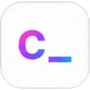

<div align="center">



# SuperCommands

**A keyboard-first workspace for the browser.**

Find and create notes, links, tasks, and saved content; run browser actions from a command bar.

[Getting started](#getting-started) · [Features](#features) · [Contributing](CONTRIBUTING.md) · [Security](SECURITY.md) · [Code of Conduct](CODE_OF_CONDUCT.md) · [License](LICENSE)

</div>

## What is SuperCommands?

SuperCommands, formerly cmdOS, is a Chrome Manifest V3 extension with a new-tab workspace and a website command interface. Press **Alt+S** to open Command Search on a supported website or New Tab. Check **Alt + S Search** at `chrome://extensions/shortcuts` if the shortcut is unavailable. Its manifest command is `open_alts`.

Core records are stored locally in IndexedDB and extension storage. There is no website account login or signup. Optional Google Drive backup uses a separate Google connection. AI and other external integrations can send content to their services; local storage does not mean every feature works offline.

## Features

- Manage notes, links, todos, text expanders, AI prompts, and chat agents.
- Search saved content and use configured Create, Save, and Filter commands.
- Organize Web Clips and workspace sessions.
- Capture pages, screenshots, and extracted content where browser permissions allow it.
- Customize the new-tab workspace with views, widgets, and appearance settings.
- Back up local data manually or through the optional Google Drive connection.

Available actions depend on the active surface, configured prefixes, and permissions.

## Tech stack

| Layer | Technology |
| --- | --- |
| UI | React 19 and TypeScript |
| Build | WXT, Vite, and pnpm workspaces |
| Styling | Tailwind CSS and the existing theme registry |
| Local data | Dexie.js, IndexedDB, and extension storage |
| Browser target | Chrome Manifest V3 |

## Repository structure

| Path | Purpose |
| --- | --- |
| `entrypoints/` | WXT browser entry points |
| `background/` | Browser operations, commands, sessions, and message handlers |
| `src/pages/` | New Tab, website popup, toolbar popup, and content UI |
| `src/allObjectFolder/` | Record features and domain operations |
| `src/shared-components/` | Shared search, commands, branding, editors, and UI |
| `src/settings/` | Backup, appearance, and workspace settings |
| `src/storage/` | IndexedDB schema, migrations, and storage helpers |
| `packages/` | Shared workspace packages |
| `public/` | Required extension assets and starter Web Clips |
| `scripts/` | Artifact management; the source repository also contains private publishing tools |

The current popup is in `src/pages/AltS_search_websites/`; its background bridge is in `background/src/websitePopupBridge/`. Some internal cmdOS names remain for compatibility with saved data. Changing those identifiers is separate from product branding.

## Getting started

### Prerequisites

- Node.js `>=22.12.0`
- pnpm `9.15.1`, as declared in `package.json`
- Google Chrome or a compatible Chromium browser

### Install and run

```bash
git clone https://github.com/supercommands/supercommands.git
cd supercommands
pnpm install
pnpm dev
```

Open `chrome://extensions`, enable Developer mode, and load `.output/chrome-mv3/` as an unpacked extension. Reload the extension and refresh website tabs after rebuilding.

### Build and package

In the public repository, use the ordinary commands:

```bash
pnpm build
pnpm zip
```

Unpacked output is written to `.output/chrome-mv3/`; release copies are under `extension-artifacts/releases/chrome-oss/`. Public commands select the open-source configuration automatically. In the private source repository, the existing defaults remain; use `pnpm dev:oss`, `pnpm build:oss`, or `pnpm run wxt:zip:chrome:oss` to select the public configuration explicitly.

The public `env.oss` contains the OSS Google OAuth client ID and a non-secret Drive enable flag, without a client secret or extension signing key. Drive authorization also depends on Google accepting the extension's identity. Do not add private credentials or personal tokens.

The public export excludes internal documentation, test fixtures, setup screenshots, generated outputs, and private publishing scripts. Required runtime assets and starter Web Clips remain. This README and the root contribution, security, conduct, and license files are included.

## Contributing

Read [CONTRIBUTING.md](CONTRIBUTING.md) before opening a pull request. Use [issues](https://github.com/supercommands/supercommands/issues) for reproducible bugs and feature requests. Use Discussions for questions if enabled; otherwise use a relevant issue. This documentation does not claim that Discussions or private vulnerability reporting are already enabled.

Report suspected vulnerabilities through [SECURITY.md](SECURITY.md), without publishing exploit details. Participation follows the [Code of Conduct](CODE_OF_CONDUCT.md).

## License

Licensed under [Apache License 2.0](LICENSE). The official public repository and product name are SuperCommands.
